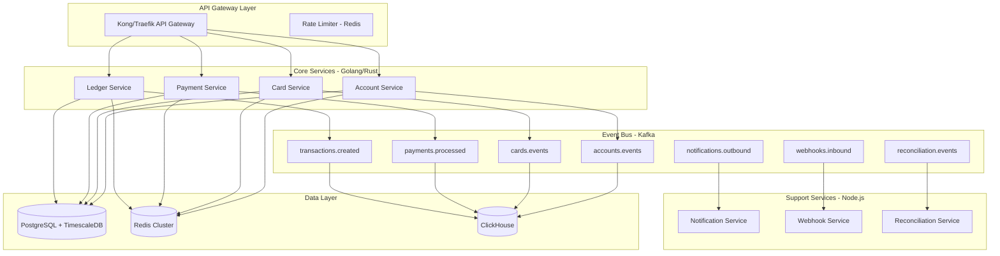
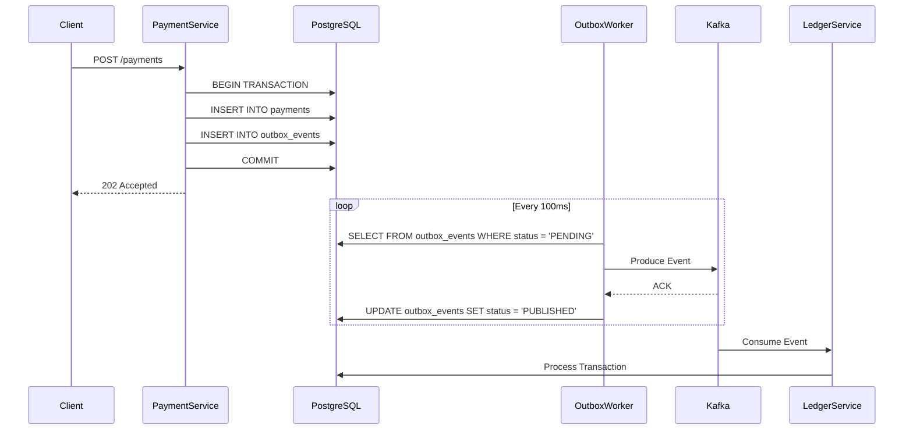
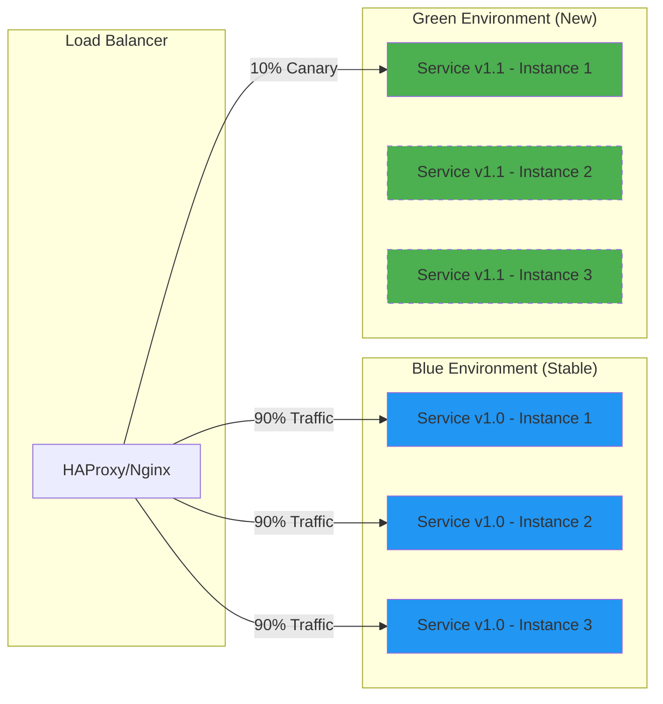
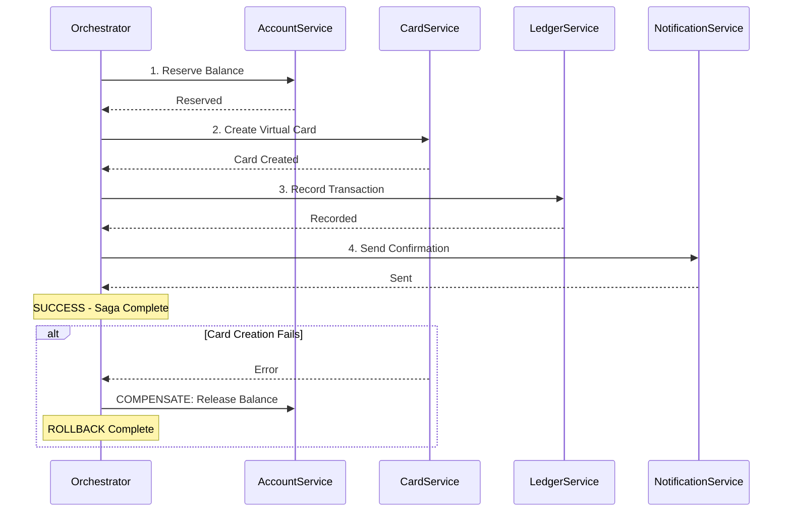
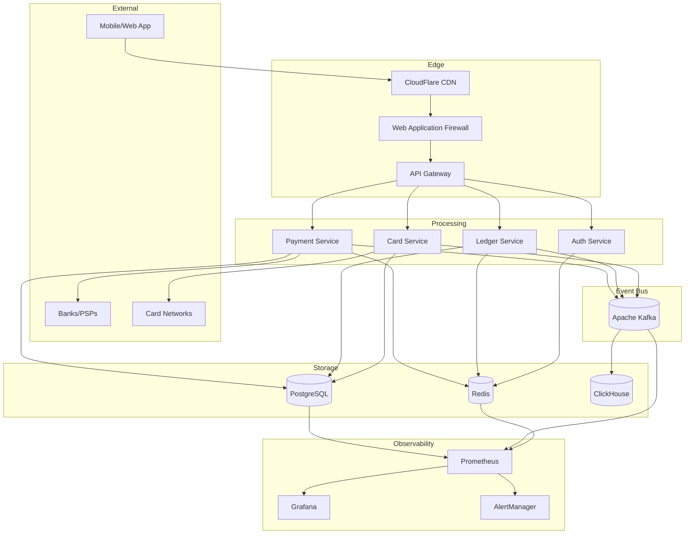

# KaminoClone - Arquitetura de Sistema Financeiro de Alta Performance

## Visão Geral

O **KaminoClone** é uma plataforma de gestão financeira, liquidez e pagamentos de nível empresarial, projetada para integrar o ecossistema TradFi (Bancos/Cartões) com sistemas modernos de alta performance.

### Princípios Arquiteturais

| Princípio | Descrição | Implementação |
|-----------|-----------|---------------|
| **Fault-Tolerant** | Zero downtime em transações críticas | Circuit Breakers, Retry Policies, Event Sourcing |
| **Hyper Secure** | Compliance PCI-DSS, LGPD | E2E Encryption, HSM, Data Masking |
| **High Performance** | Milhares de TPS | Golang/Rust, Kafka, Redis, Connection Pooling |
| **Eventual Consistency** | Dados distribuídos consistentes | Saga Pattern, Outbox Pattern |

---

## 1. ARQUITETURA DE SOFTWARE (ANTI-FALHAS)

### 1.1 Event-Driven Architecture (EDA)

A arquitetura é baseada em **microservices orientados a eventos**, onde cada domínio de negócio é isolado e se comunica através do Apache Kafka.



### 1.2 Padrão Outbox - Garantia de Entrega

O **Outbox Pattern** garante que nenhuma transação seja perdida, mesmo que o Kafka ou o serviço caia durante o processamento.



#### Implementação da Tabela Outbox

```sql
-- Schema: event_sourcing
CREATE TABLE event_sourcing.outbox_events (
    id UUID PRIMARY KEY DEFAULT gen_random_uuid(),
    aggregate_type VARCHAR(100) NOT NULL,
    aggregate_id UUID NOT NULL,
    event_type VARCHAR(100) NOT NULL,
    payload JSONB NOT NULL,
    metadata JSONB DEFAULT '{}',
    status VARCHAR(20) DEFAULT 'PENDING' CHECK (status IN ('PENDING', 'PUBLISHED', 'FAILED')),
    retry_count INT DEFAULT 0,
    max_retries INT DEFAULT 5,
    created_at TIMESTAMPTZ DEFAULT NOW(),
    published_at TIMESTAMPTZ,
    error_message TEXT,
    
    -- Índices para polling eficiente
    CONSTRAINT outbox_retry_limit CHECK (retry_count <= max_retries)
);

CREATE INDEX idx_outbox_pending ON event_sourcing.outbox_events(status, created_at) 
    WHERE status = 'PENDING';
CREATE INDEX idx_outbox_aggregate ON event_sourcing.outbox_events(aggregate_type, aggregate_id);
```

### 1.3 Circuit Breaker + Retry com Backoff Exponencial

Implementação em Go usando o padrão Circuit Breaker para chamadas externas (bancos, processadores de cartão):

```go
// internal/resilience/circuit_breaker.go
package resilience

import (
    "context"
    "errors"
    "math"
    "sync"
    "time"
)

type State int

const (
    StateClosed State = iota
    StateOpen
    StateHalfOpen
)

type CircuitBreaker struct {
    mu              sync.RWMutex
    state           State
    failures        int
    successes       int
    lastFailure     time.Time
    
    // Configurações
    maxFailures     int
    timeout         time.Duration
    halfOpenMax     int
}

type RetryConfig struct {
    MaxRetries      int
    InitialDelay    time.Duration
    MaxDelay        time.Duration
    Multiplier      float64
    JitterFactor    float64
}

func NewCircuitBreaker(maxFailures int, timeout time.Duration) *CircuitBreaker {
    return &CircuitBreaker{
        state:       StateClosed,
        maxFailures: maxFailures,
        timeout:     timeout,
        halfOpenMax: 3,
    }
}

func (cb *CircuitBreaker) Execute(ctx context.Context, fn func() error) error {
    if !cb.canExecute() {
        return errors.New("circuit breaker is open")
    }
    
    err := fn()
    cb.recordResult(err)
    return err
}

func (cb *CircuitBreaker) canExecute() bool {
    cb.mu.RLock()
    defer cb.mu.RUnlock()
    
    switch cb.state {
    case StateClosed:
        return true
    case StateOpen:
        if time.Since(cb.lastFailure) > cb.timeout {
            cb.mu.RUnlock()
            cb.mu.Lock()
            cb.state = StateHalfOpen
            cb.successes = 0
            cb.mu.Unlock()
            cb.mu.RLock()
            return true
        }
        return false
    case StateHalfOpen:
        return cb.successes < cb.halfOpenMax
    }
    return false
}

// RetryWithBackoff executa função com retry e backoff exponencial
func RetryWithBackoff(ctx context.Context, cfg RetryConfig, fn func() error) error {
    var lastErr error
    
    for attempt := 0; attempt <= cfg.MaxRetries; attempt++ {
        select {
        case <-ctx.Done():
            return ctx.Err()
        default:
        }
        
        if err := fn(); err == nil {
            return nil
        } else {
            lastErr = err
        }
        
        if attempt == cfg.MaxRetries {
            break
        }
        
        // Backoff exponencial com jitter
        delay := float64(cfg.InitialDelay) * math.Pow(cfg.Multiplier, float64(attempt))
        if delay > float64(cfg.MaxDelay) {
            delay = float64(cfg.MaxDelay)
        }
        
        // Adiciona jitter para evitar thundering herd
        jitter := delay * cfg.JitterFactor * (0.5 - rand.Float64())
        sleepDuration := time.Duration(delay + jitter)
        
        timer := time.NewTimer(sleepDuration)
        select {
        case <-ctx.Done():
            timer.Stop()
            return ctx.Err()
        case <-timer.C:
        }
    }
    
    return fmt.Errorf("max retries exceeded: %w", lastErr)
}
```

### 1.4 Idempotency Keys

Todas as APIs de mutação devem suportar **Idempotency Keys** para evitar processamento duplo:

```go
// internal/middleware/idempotency.go
package middleware

import (
    "context"
    "crypto/sha256"
    "encoding/hex"
    "encoding/json"
    "net/http"
    "time"
    
    "github.com/go-redis/redis/v8"
)

type IdempotencyMiddleware struct {
    redis *redis.Client
    ttl   time.Duration
}

type IdempotentResponse struct {
    StatusCode int               `json:"status_code"`
    Headers    map[string]string `json:"headers"`
    Body       []byte            `json:"body"`
    CreatedAt  time.Time         `json:"created_at"`
}

func NewIdempotencyMiddleware(redis *redis.Client, ttl time.Duration) *IdempotencyMiddleware {
    return &IdempotencyMiddleware{redis: redis, ttl: ttl}
}

func (m *IdempotencyMiddleware) Handle(next http.Handler) http.Handler {
    return http.HandlerFunc(func(w http.ResponseWriter, r *http.Request) {
        // Apenas para métodos não-idempotentes
        if r.Method != http.MethodPost && r.Method != http.MethodPatch {
            next.ServeHTTP(w, r)
            return
        }
        
        idempotencyKey := r.Header.Get("Idempotency-Key")
        if idempotencyKey == "" {
            next.ServeHTTP(w, r)
            return
        }
        
        // Gera chave única baseada no path + idempotency key + user
        cacheKey := m.generateCacheKey(r, idempotencyKey)
        
        // Verifica se já existe resposta em cache
        ctx := r.Context()
        cached, err := m.redis.Get(ctx, cacheKey).Bytes()
        if err == nil {
            var resp IdempotentResponse
            if json.Unmarshal(cached, &resp) == nil {
                // Retorna resposta cacheada
                for k, v := range resp.Headers {
                    w.Header().Set(k, v)
                }
                w.Header().Set("X-Idempotent-Replay", "true")
                w.WriteHeader(resp.StatusCode)
                w.Write(resp.Body)
                return
            }
        }
        
        // Lock distribuído para evitar race conditions
        lockKey := "lock:" + cacheKey
        acquired, err := m.redis.SetNX(ctx, lockKey, "1", 30*time.Second).Result()
        if err != nil || !acquired {
            http.Error(w, "Request already in progress", http.StatusConflict)
            return
        }
        defer m.redis.Del(ctx, lockKey)
        
        // Captura a resposta
        recorder := NewResponseRecorder(w)
        next.ServeHTTP(recorder, r)
        
        // Armazena apenas respostas de sucesso
        if recorder.StatusCode >= 200 && recorder.StatusCode < 300 {
            resp := IdempotentResponse{
                StatusCode: recorder.StatusCode,
                Headers:    recorder.Headers(),
                Body:       recorder.Body(),
                CreatedAt:  time.Now(),
            }
            
            data, _ := json.Marshal(resp)
            m.redis.Set(ctx, cacheKey, data, m.ttl)
        }
    })
}

func (m *IdempotencyMiddleware) generateCacheKey(r *http.Request, idempotencyKey string) string {
    userID := r.Header.Get("X-User-ID")
    data := r.URL.Path + ":" + userID + ":" + idempotencyKey
    hash := sha256.Sum256([]byte(data))
    return "idempotency:" + hex.EncodeToString(hash[:])
}
```

### 1.5 Estratégia de Deploy: Blue-Green com Canary



#### Docker Swarm Config para Blue-Green

```yaml
# deploy/swarm/payment-service.yml
version: "3.8"

services:
  payment-service-blue:
    image: kaminoclone/payment-service:${BLUE_VERSION:-1.0.0}
    deploy:
      replicas: 3
      update_config:
        parallelism: 1
        delay: 30s
        failure_action: rollback
        monitor: 60s
        order: start-first
      rollback_config:
        parallelism: 1
        delay: 10s
      resources:
        limits:
          cpus: '2'
          memory: 2G
        reservations:
          cpus: '1'
          memory: 1G
      labels:
        - "traefik.enable=true"
        - "traefik.http.routers.payment-blue.rule=Host(`api.kamino.io`) && PathPrefix(`/v1/payments`)"
        - "traefik.http.routers.payment-blue.priority=10"
        - "traefik.http.services.payment-blue.loadbalancer.server.port=8080"
        - "traefik.http.services.payment-blue.loadbalancer.sticky.cookie=true"
    healthcheck:
      test: ["CMD", "curl", "-f", "http://localhost:8080/health"]
      interval: 10s
      timeout: 5s
      retries: 3
      start_period: 40s
    networks:
      - kamino-network

  payment-service-green:
    image: kaminoclone/payment-service:${GREEN_VERSION:-1.1.0}
    deploy:
      replicas: 1
      labels:
        - "traefik.enable=true"
        - "traefik.http.routers.payment-green.rule=Host(`api.kamino.io`) && PathPrefix(`/v1/payments`) && Headers(`X-Canary`, `true`)"
        - "traefik.http.routers.payment-green.priority=20"
        - "traefik.http.services.payment-green.loadbalancer.server.port=8080"
    networks:
      - kamino-network

networks:
  kamino-network:
    external: true
```

---

## 2. Comunicação Inter-Serviços

### 2.1 Saga Pattern para Transações Distribuídas

Para operações que envolvem múltiplos serviços (ex: criar cartão virtual + debitar conta + registrar ledger), usamos o **Saga Pattern** com compensação:



```go
// internal/saga/orchestrator.go
package saga

import (
    "context"
    "fmt"
)

type Step struct {
    Name       string
    Execute    func(ctx context.Context, data interface{}) error
    Compensate func(ctx context.Context, data interface{}) error
}

type Saga struct {
    steps     []Step
    executed  []int
}

func NewSaga() *Saga {
    return &Saga{
        steps:    make([]Step, 0),
        executed: make([]int, 0),
    }
}

func (s *Saga) AddStep(step Step) {
    s.steps = append(s.steps, step)
}

func (s *Saga) Execute(ctx context.Context, data interface{}) error {
    for i, step := range s.steps {
        if err := step.Execute(ctx, data); err != nil {
            // Executar compensações em ordem reversa
            for j := len(s.executed) - 1; j >= 0; j-- {
                idx := s.executed[j]
                if s.steps[idx].Compensate != nil {
                    if compErr := s.steps[idx].Compensate(ctx, data); compErr != nil {
                        // Log compensation failure - requer intervenção manual
                        return fmt.Errorf("saga compensation failed at step %s: %w (original: %v)", 
                            s.steps[idx].Name, compErr, err)
                    }
                }
            }
            return fmt.Errorf("saga failed at step %s: %w", step.Name, err)
        }
        s.executed = append(s.executed, i)
    }
    return nil
}
```

---

## 3. Estrutura de Diretórios do Projeto

```
kaminoclone/
├── docker-compose.yml
├── docker-compose.prod.yml
├── Makefile
├── README.md
│
├── deploy/
│   ├── docker/
│   │   ├── Dockerfile.ledger
│   │   ├── Dockerfile.payment
│   │   └── Dockerfile.gateway
│   ├── kubernetes/
│   │   ├── namespaces.yaml
│   │   ├── configmaps/
│   │   ├── secrets/
│   │   └── services/
│   └── swarm/
│       └── stack.yml
│
├── services/
│   ├── ledger-service/          # Go - Core financeiro
│   │   ├── cmd/
│   │   ├── internal/
│   │   │   ├── domain/
│   │   │   ├── repository/
│   │   │   ├── usecase/
│   │   │   └── delivery/
│   │   ├── pkg/
│   │   └── go.mod
│   │
│   ├── payment-service/         # Go - Processamento de pagamentos
│   ├── card-service/            # Rust - Gestão de cartões
│   ├── account-service/         # Go - Contas e KYC
│   ├── notification-service/    # Node.js - Notificações
│   ├── webhook-service/         # Node.js - Webhooks
│   ├── reconciliation-service/  # Python - Reconciliação bancária
│   └── api-gateway/             # Kong/Custom Gateway
│
├── shared/
│   ├── proto/                   # Protocol Buffers
│   ├── events/                  # Event schemas (Avro/JSON Schema)
│   └── libs/
│       ├── go-common/
│       ├── node-common/
│       └── rust-common/
│
├── database/
│   ├── migrations/
│   │   ├── postgresql/
│   │   └── clickhouse/
│   ├── seeds/
│   └── schema.sql
│
├── analytics/
│   ├── clickhouse/
│   │   ├── tables.sql
│   │   └── materialized_views.sql
│   └── grafana/
│       └── dashboards/
│
├── scripts/
│   ├── init-kafka-topics.sh
│   ├── backup-postgres.sh
│   └── rotate-secrets.sh
│
└── docs/
    ├── architecture/
    ├── api/
    └── runbooks/
```

---

## 4. Fluxo de Dados Principal



Este documento continua no arquivo `docs/database-schema.md` com o schema completo do banco de dados.
