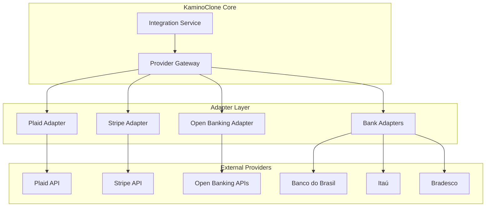
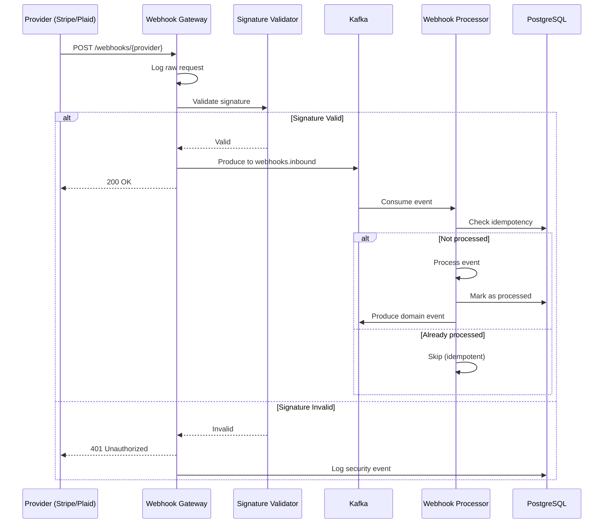

# KaminoClone - Arquitetura de Integrações Bancárias e Cartões

## 1. Visão Geral da Arquitetura de Integrações

A arquitetura de integrações do KaminoClone segue o **Adapter Pattern** para normalizar diferentes respostas de provedores externos, garantindo que o core do sistema permaneça agnóstico às particularidades de cada banco ou processador de cartão.



## 2. Padrão Adapter - Implementação

### 2.1 Interface Base do Provider

```go
// internal/integrations/provider.go
package integrations

import (
    "context"
    "time"
)

// ProviderType identifica o tipo de provedor
type ProviderType string

const (
    ProviderTypePlaid      ProviderType = "PLAID"
    ProviderTypeStripe     ProviderType = "STRIPE"
    ProviderTypeOpenBanking ProviderType = "OPEN_BANKING"
    ProviderTypePIX        ProviderType = "PIX"
)

// ProviderConfig configuração comum para todos os providers
type ProviderConfig struct {
    BaseURL        string
    APIKey         string
    SecretKey      string
    WebhookSecret  string
    Timeout        time.Duration
    MaxRetries     int
    CircuitBreaker CircuitBreakerConfig
}

// CircuitBreakerConfig configuração do circuit breaker
type CircuitBreakerConfig struct {
    MaxFailures     int
    Timeout         time.Duration
    HalfOpenMaxReqs int
}

// Provider interface que todos os adapters devem implementar
type Provider interface {
    // Identidade
    GetType() ProviderType
    GetName() string
    
    // Health check
    HealthCheck(ctx context.Context) error
    
    // Lifecycle
    Initialize(ctx context.Context, config ProviderConfig) error
    Shutdown(ctx context.Context) error
}

// PaymentProvider interface para provedores de pagamento
type PaymentProvider interface {
    Provider
    
    // Pagamentos
    CreatePayment(ctx context.Context, req CreatePaymentRequest) (*PaymentResponse, error)
    GetPayment(ctx context.Context, paymentID string) (*PaymentResponse, error)
    CancelPayment(ctx context.Context, paymentID string) error
    RefundPayment(ctx context.Context, req RefundRequest) (*RefundResponse, error)
    
    // Webhooks
    ValidateWebhook(payload []byte, signature string) error
    ParseWebhookEvent(payload []byte) (*WebhookEvent, error)
}

// BankingProvider interface para provedores bancários
type BankingProvider interface {
    Provider
    
    // Contas
    GetAccounts(ctx context.Context, userToken string) ([]BankAccount, error)
    GetBalance(ctx context.Context, accountID string) (*Balance, error)
    GetTransactions(ctx context.Context, req TransactionHistoryRequest) ([]BankTransaction, error)
    
    // Transferências
    InitiateTransfer(ctx context.Context, req TransferRequest) (*TransferResponse, error)
    GetTransferStatus(ctx context.Context, transferID string) (*TransferStatus, error)
}

// CardProvider interface para processadores de cartão
type CardProvider interface {
    Provider
    
    // Cartões
    IssueCard(ctx context.Context, req IssueCardRequest) (*CardResponse, error)
    ActivateCard(ctx context.Context, cardID string) error
    BlockCard(ctx context.Context, cardID string, reason string) error
    SetPIN(ctx context.Context, cardID string, encryptedPIN string) error
    
    // Transações
    Authorize(ctx context.Context, req AuthorizationRequest) (*AuthorizationResponse, error)
    Capture(ctx context.Context, authID string, amount int64) (*CaptureResponse, error)
    Void(ctx context.Context, authID string) error
    
    // Limites
    SetLimits(ctx context.Context, cardID string, limits CardLimits) error
    GetLimits(ctx context.Context, cardID string) (*CardLimits, error)
}
```

### 2.2 Request/Response Normalizados

```go
// internal/integrations/models.go
package integrations

import "time"

// ========================================
// PAYMENT MODELS
// ========================================

type CreatePaymentRequest struct {
    IdempotencyKey    string            `json:"idempotency_key"`
    Amount            int64             `json:"amount"`  // Em centavos
    Currency          string            `json:"currency"`
    PaymentMethod     string            `json:"payment_method"`
    Description       string            `json:"description"`
    CustomerID        string            `json:"customer_id"`
    Metadata          map[string]string `json:"metadata"`
    
    // PIX específico
    PIXKey            string            `json:"pix_key,omitempty"`
    PIXKeyType        string            `json:"pix_key_type,omitempty"`
    
    // Boleto específico
    DueDate           *time.Time        `json:"due_date,omitempty"`
    Instructions      []string          `json:"instructions,omitempty"`
    
    // Transferência
    DestinationBank   string            `json:"destination_bank,omitempty"`
    DestinationBranch string            `json:"destination_branch,omitempty"`
    DestinationAccount string           `json:"destination_account,omitempty"`
}

type PaymentResponse struct {
    ID                string            `json:"id"`
    ProviderID        string            `json:"provider_id"`
    Status            PaymentStatus     `json:"status"`
    Amount            int64             `json:"amount"`
    Currency          string            `json:"currency"`
    PaymentMethod     string            `json:"payment_method"`
    
    // Timestamps
    CreatedAt         time.Time         `json:"created_at"`
    ProcessedAt       *time.Time        `json:"processed_at,omitempty"`
    
    // PIX específico
    PIXCopiaECola     string            `json:"pix_copia_e_cola,omitempty"`
    PIXQRCode         string            `json:"pix_qr_code,omitempty"`
    
    // Boleto específico
    BoletoBarcode     string            `json:"boleto_barcode,omitempty"`
    BoletoURL         string            `json:"boleto_url,omitempty"`
    
    // Metadados do provider
    ProviderMetadata  map[string]interface{} `json:"provider_metadata,omitempty"`
}

type PaymentStatus string

const (
    PaymentStatusPending    PaymentStatus = "PENDING"
    PaymentStatusProcessing PaymentStatus = "PROCESSING"
    PaymentStatusCompleted  PaymentStatus = "COMPLETED"
    PaymentStatusFailed     PaymentStatus = "FAILED"
    PaymentStatusCancelled  PaymentStatus = "CANCELLED"
    PaymentStatusRefunded   PaymentStatus = "REFUNDED"
)

// ========================================
// CARD MODELS
// ========================================

type IssueCardRequest struct {
    UserID           string            `json:"user_id"`
    CardType         string            `json:"card_type"`  // VIRTUAL, PHYSICAL
    Brand            string            `json:"brand"`      // VISA, MASTERCARD
    CardholderName   string            `json:"cardholder_name"`
    BillingAddress   Address           `json:"billing_address"`
    ShippingAddress  *Address          `json:"shipping_address,omitempty"`
    InitialLimits    CardLimits        `json:"initial_limits"`
    Metadata         map[string]string `json:"metadata"`
}

type CardResponse struct {
    ID               string            `json:"id"`
    ProviderCardID   string            `json:"provider_card_id"`
    PANToken         string            `json:"pan_token"`  // Token, não o PAN real
    PANLastFour      string            `json:"pan_last_four"`
    ExpiryMonth      int               `json:"expiry_month"`
    ExpiryYear       int               `json:"expiry_year"`
    CVVToken         string            `json:"cvv_token,omitempty"`  // Só para virtual
    Status           CardStatus        `json:"status"`
    Brand            string            `json:"brand"`
    CardType         string            `json:"card_type"`
    CreatedAt        time.Time         `json:"created_at"`
}

type AuthorizationRequest struct {
    CardID           string            `json:"card_id"`
    Amount           int64             `json:"amount"`
    Currency         string            `json:"currency"`
    MerchantName     string            `json:"merchant_name"`
    MerchantMCC      string            `json:"merchant_mcc"`
    MerchantCity     string            `json:"merchant_city"`
    MerchantCountry  string            `json:"merchant_country"`
    IsEcommerce      bool              `json:"is_ecommerce"`
    ThreeDSData      *ThreeDSData      `json:"three_ds_data,omitempty"`
}

type AuthorizationResponse struct {
    ID               string            `json:"id"`
    Approved         bool              `json:"approved"`
    DeclineCode      string            `json:"decline_code,omitempty"`
    DeclineReason    string            `json:"decline_reason,omitempty"`
    AuthorizedAmount int64             `json:"authorized_amount"`
    ProcessedAt      time.Time         `json:"processed_at"`
}

// ========================================
// BANKING MODELS
// ========================================

type BankAccount struct {
    ID               string            `json:"id"`
    ProviderID       string            `json:"provider_id"`
    InstitutionID    string            `json:"institution_id"`
    InstitutionName  string            `json:"institution_name"`
    AccountType      string            `json:"account_type"`
    AccountNumber    string            `json:"account_number_masked"`
    BranchNumber     string            `json:"branch_number"`
    Currency         string            `json:"currency"`
    Status           string            `json:"status"`
}

type Balance struct {
    AccountID        string            `json:"account_id"`
    Available        int64             `json:"available"`
    Current          int64             `json:"current"`
    Currency         string            `json:"currency"`
    UpdatedAt        time.Time         `json:"updated_at"`
}

type TransferRequest struct {
    IdempotencyKey   string            `json:"idempotency_key"`
    SourceAccountID  string            `json:"source_account_id"`
    Amount           int64             `json:"amount"`
    Currency         string            `json:"currency"`
    
    // Destino
    DestinationType  string            `json:"destination_type"`  // PIX, TED, INTERNAL
    PIXKey           string            `json:"pix_key,omitempty"`
    PIXKeyType       string            `json:"pix_key_type,omitempty"`
    BankCode         string            `json:"bank_code,omitempty"`
    BranchNumber     string            `json:"branch_number,omitempty"`
    AccountNumber    string            `json:"account_number,omitempty"`
    AccountType      string            `json:"account_type,omitempty"`
    RecipientName    string            `json:"recipient_name"`
    RecipientTaxID   string            `json:"recipient_tax_id"`
    
    Description      string            `json:"description"`
    ScheduledFor     *time.Time        `json:"scheduled_for,omitempty"`
}
```

### 2.3 Implementação do Adapter Stripe

```go
// internal/integrations/stripe/adapter.go
package stripe

import (
    "context"
    "fmt"
    "time"
    
    "github.com/stripe/stripe-go/v75"
    "github.com/stripe/stripe-go/v75/paymentintent"
    "github.com/stripe/stripe-go/v75/refund"
    
    "kaminoclone/internal/integrations"
)

type StripeAdapter struct {
    config integrations.ProviderConfig
    client *stripe.Client
}

func NewStripeAdapter() *StripeAdapter {
    return &StripeAdapter{}
}

func (s *StripeAdapter) GetType() integrations.ProviderType {
    return integrations.ProviderTypeStripe
}

func (s *StripeAdapter) GetName() string {
    return "Stripe"
}

func (s *StripeAdapter) Initialize(ctx context.Context, config integrations.ProviderConfig) error {
    s.config = config
    stripe.Key = config.APIKey
    return nil
}

func (s *StripeAdapter) HealthCheck(ctx context.Context) error {
    // Faz uma chamada simples para verificar conectividade
    _, err := paymentintent.List(&stripe.PaymentIntentListParams{
        ListParams: stripe.ListParams{
            Limit: stripe.Int64(1),
        },
    }).Next()
    return err
}

func (s *StripeAdapter) CreatePayment(ctx context.Context, req integrations.CreatePaymentRequest) (*integrations.PaymentResponse, error) {
    params := &stripe.PaymentIntentCreateParams{
        Amount:   stripe.Int64(req.Amount),
        Currency: stripe.String(req.Currency),
        Metadata: req.Metadata,
        
        // Idempotency key via header
        IdempotencyKey: stripe.String(req.IdempotencyKey),
    }
    
    if req.Description != "" {
        params.Description = stripe.String(req.Description)
    }
    
    pi, err := paymentintent.New(params)
    if err != nil {
        return nil, s.mapError(err)
    }
    
    return &integrations.PaymentResponse{
        ID:           req.IdempotencyKey,
        ProviderID:   pi.ID,
        Status:       s.mapStatus(pi.Status),
        Amount:       pi.Amount,
        Currency:     string(pi.Currency),
        CreatedAt:    time.Unix(pi.Created, 0),
        ProviderMetadata: map[string]interface{}{
            "client_secret": pi.ClientSecret,
        },
    }, nil
}

func (s *StripeAdapter) GetPayment(ctx context.Context, paymentID string) (*integrations.PaymentResponse, error) {
    pi, err := paymentintent.Get(paymentID, nil)
    if err != nil {
        return nil, s.mapError(err)
    }
    
    return &integrations.PaymentResponse{
        ProviderID: pi.ID,
        Status:     s.mapStatus(pi.Status),
        Amount:     pi.Amount,
        Currency:   string(pi.Currency),
        CreatedAt:  time.Unix(pi.Created, 0),
    }, nil
}

func (s *StripeAdapter) RefundPayment(ctx context.Context, req integrations.RefundRequest) (*integrations.RefundResponse, error) {
    params := &stripe.RefundCreateParams{
        PaymentIntent: stripe.String(req.PaymentID),
    }
    
    if req.Amount > 0 {
        params.Amount = stripe.Int64(req.Amount)
    }
    
    r, err := refund.New(params)
    if err != nil {
        return nil, s.mapError(err)
    }
    
    return &integrations.RefundResponse{
        ID:        r.ID,
        Amount:    r.Amount,
        Status:    string(r.Status),
        CreatedAt: time.Unix(r.Created, 0),
    }, nil
}

func (s *StripeAdapter) ValidateWebhook(payload []byte, signature string) error {
    _, err := stripe.ConstructEvent(payload, signature, s.config.WebhookSecret)
    return err
}

func (s *StripeAdapter) ParseWebhookEvent(payload []byte) (*integrations.WebhookEvent, error) {
    event, err := stripe.ConstructEventWithoutVerify(payload)
    if err != nil {
        return nil, err
    }
    
    return &integrations.WebhookEvent{
        ID:        event.ID,
        Type:      string(event.Type),
        CreatedAt: time.Unix(event.Created, 0),
        Data:      event.Data.Raw,
    }, nil
}

// Mapeia status do Stripe para status interno
func (s *StripeAdapter) mapStatus(status stripe.PaymentIntentStatus) integrations.PaymentStatus {
    switch status {
    case stripe.PaymentIntentStatusRequiresPaymentMethod,
         stripe.PaymentIntentStatusRequiresConfirmation,
         stripe.PaymentIntentStatusRequiresAction:
        return integrations.PaymentStatusPending
    case stripe.PaymentIntentStatusProcessing:
        return integrations.PaymentStatusProcessing
    case stripe.PaymentIntentStatusSucceeded:
        return integrations.PaymentStatusCompleted
    case stripe.PaymentIntentStatusCanceled:
        return integrations.PaymentStatusCancelled
    default:
        return integrations.PaymentStatusPending
    }
}

// Mapeia erros do Stripe para erros internos
func (s *StripeAdapter) mapError(err error) error {
    if stripeErr, ok := err.(*stripe.Error); ok {
        return integrations.NewProviderError(
            integrations.ProviderTypeStripe,
            stripeErr.Code,
            stripeErr.Msg,
            stripeErr.HTTPStatusCode,
        )
    }
    return err
}
```

## 3. Gestão de Webhooks

### 3.1 Arquitetura de Webhooks



### 3.2 Processador de Webhooks com Ordenação

```go
// internal/webhooks/processor.go
package webhooks

import (
    "context"
    "encoding/json"
    "fmt"
    "sync"
    "time"
    
    "github.com/segmentio/kafka-go"
)

type WebhookProcessor struct {
    adapters     map[string]integrations.Provider
    kafkaReader  *kafka.Reader
    kafkaWriter  *kafka.Writer
    db           *sql.DB
    
    // Buffer para ordenação de eventos
    eventBuffer  map[string]*OrderedEventBuffer
    bufferMu     sync.RWMutex
}

// OrderedEventBuffer mantém eventos ordenados por sequência
type OrderedEventBuffer struct {
    entityID      string
    events        []*WebhookEvent
    lastProcessed int64
    mu            sync.Mutex
}

type WebhookEvent struct {
    ID            string
    Provider      string
    EventType     string
    EntityID      string
    SequenceNum   int64
    Payload       json.RawMessage
    ReceivedAt    time.Time
    Signature     string
}

func (p *WebhookProcessor) ProcessWebhook(ctx context.Context, event *WebhookEvent) error {
    // 1. Verificar idempotência
    exists, err := p.checkIdempotency(ctx, event.Provider, event.ID)
    if err != nil {
        return fmt.Errorf("idempotency check failed: %w", err)
    }
    if exists {
        return nil // Já processado
    }
    
    // 2. Validar assinatura
    adapter, ok := p.adapters[event.Provider]
    if !ok {
        return fmt.Errorf("unknown provider: %s", event.Provider)
    }
    
    if err := adapter.ValidateWebhook(event.Payload, event.Signature); err != nil {
        return fmt.Errorf("invalid webhook signature: %w", err)
    }
    
    // 3. Garantir ordenação se necessário
    if event.SequenceNum > 0 {
        if err := p.ensureOrdering(ctx, event); err != nil {
            return fmt.Errorf("ordering failed: %w", err)
        }
    }
    
    // 4. Processar evento
    if err := p.handleEvent(ctx, event); err != nil {
        return fmt.Errorf("event handling failed: %w", err)
    }
    
    // 5. Marcar como processado
    if err := p.markProcessed(ctx, event); err != nil {
        return fmt.Errorf("mark processed failed: %w", err)
    }
    
    return nil
}

func (p *WebhookProcessor) ensureOrdering(ctx context.Context, event *WebhookEvent) error {
    p.bufferMu.Lock()
    buffer, exists := p.eventBuffer[event.EntityID]
    if !exists {
        buffer = &OrderedEventBuffer{
            entityID:      event.EntityID,
            events:        make([]*WebhookEvent, 0),
            lastProcessed: 0,
        }
        p.eventBuffer[event.EntityID] = buffer
    }
    p.bufferMu.Unlock()
    
    buffer.mu.Lock()
    defer buffer.mu.Unlock()
    
    // Verificar se é o próximo na sequência
    expectedSeq := buffer.lastProcessed + 1
    if event.SequenceNum == expectedSeq {
        // Processar imediatamente
        return nil
    }
    
    if event.SequenceNum > expectedSeq {
        // Evento futuro - armazenar no buffer
        buffer.events = append(buffer.events, event)
        
        // Esperar por eventos faltantes (com timeout)
        return p.waitForMissingEvents(ctx, buffer, expectedSeq, event.SequenceNum)
    }
    
    // Evento duplicado (já processado)
    return nil
}

func (p *WebhookProcessor) waitForMissingEvents(ctx context.Context, buffer *OrderedEventBuffer, expected, current int64) error {
    timeout := time.After(30 * time.Second)
    ticker := time.NewTicker(100 * time.Millisecond)
    defer ticker.Stop()
    
    for {
        select {
        case <-ctx.Done():
            return ctx.Err()
        case <-timeout:
            // Timeout - processar mesmo fora de ordem e logar
            return fmt.Errorf("timeout waiting for sequence %d (current: %d)", expected, current)
        case <-ticker.C:
            // Verificar se eventos faltantes chegaram
            if buffer.lastProcessed >= expected-1 {
                return nil
            }
        }
    }
}

func (p *WebhookProcessor) handleEvent(ctx context.Context, event *WebhookEvent) error {
    // Mapear tipo de evento para handler
    switch event.EventType {
    case "payment_intent.succeeded":
        return p.handlePaymentSucceeded(ctx, event)
    case "payment_intent.failed":
        return p.handlePaymentFailed(ctx, event)
    case "charge.refunded":
        return p.handleRefund(ctx, event)
    case "account.updated":
        return p.handleAccountUpdate(ctx, event)
    default:
        // Evento desconhecido - logar mas não falhar
        return nil
    }
}

func (p *WebhookProcessor) handlePaymentSucceeded(ctx context.Context, event *WebhookEvent) error {
    // Publicar evento de domínio
    domainEvent := map[string]interface{}{
        "event_type":    "PaymentCompleted",
        "provider":      event.Provider,
        "provider_id":   event.ID,
        "payload":       event.Payload,
        "processed_at":  time.Now().UTC(),
    }
    
    data, _ := json.Marshal(domainEvent)
    return p.kafkaWriter.WriteMessages(ctx, kafka.Message{
        Topic: "payments.completed",
        Key:   []byte(event.EntityID),
        Value: data,
    })
}
```

## 4. Gestão de Segredos com Vault

### 4.1 Estrutura de Segredos

```
vault/
├── secret/
│   ├── kamino/
│   │   ├── stripe/
│   │   │   ├── api_key
│   │   │   ├── secret_key
│   │   │   └── webhook_secret
│   │   ├── plaid/
│   │   │   ├── client_id
│   │   │   ├── secret
│   │   │   └── webhook_verification_key
│   │   ├── banks/
│   │   │   ├── bb/
│   │   │   │   ├── client_id
│   │   │   │   ├── client_secret
│   │   │   │   └── certificate
│   │   │   └── itau/
│   │   │       └── ...
│   │   └── encryption/
│   │       ├── master_key
│   │       └── data_keys/
│   └── pki/
│       └── certificates/
```

### 4.2 Cliente Vault em Go

```go
// internal/secrets/vault.go
package secrets

import (
    "context"
    "fmt"
    "sync"
    "time"
    
    vault "github.com/hashicorp/vault/api"
)

type VaultClient struct {
    client    *vault.Client
    cache     map[string]*CachedSecret
    cacheMu   sync.RWMutex
    cacheTTL  time.Duration
}

type CachedSecret struct {
    Value     map[string]interface{}
    ExpiresAt time.Time
}

type SecretConfig struct {
    Address   string
    Token     string
    Namespace string
    CacheTTL  time.Duration
}

func NewVaultClient(config SecretConfig) (*VaultClient, error) {
    vaultConfig := vault.DefaultConfig()
    vaultConfig.Address = config.Address
    
    client, err := vault.NewClient(vaultConfig)
    if err != nil {
        return nil, fmt.Errorf("failed to create vault client: %w", err)
    }
    
    client.SetToken(config.Token)
    if config.Namespace != "" {
        client.SetNamespace(config.Namespace)
    }
    
    return &VaultClient{
        client:   client,
        cache:    make(map[string]*CachedSecret),
        cacheTTL: config.CacheTTL,
    }, nil
}

// GetSecret obtém um segredo do Vault (com cache)
func (v *VaultClient) GetSecret(ctx context.Context, path string) (map[string]interface{}, error) {
    // Verificar cache
    v.cacheMu.RLock()
    cached, exists := v.cache[path]
    v.cacheMu.RUnlock()
    
    if exists && time.Now().Before(cached.ExpiresAt) {
        return cached.Value, nil
    }
    
    // Buscar do Vault
    secret, err := v.client.KVv2("secret").Get(ctx, path)
    if err != nil {
        return nil, fmt.Errorf("failed to get secret: %w", err)
    }
    
    // Atualizar cache
    v.cacheMu.Lock()
    v.cache[path] = &CachedSecret{
        Value:     secret.Data,
        ExpiresAt: time.Now().Add(v.cacheTTL),
    }
    v.cacheMu.Unlock()
    
    return secret.Data, nil
}

// GetProviderCredentials obtém credenciais de um provider
func (v *VaultClient) GetProviderCredentials(ctx context.Context, provider string) (*ProviderCredentials, error) {
    path := fmt.Sprintf("kamino/%s", provider)
    data, err := v.GetSecret(ctx, path)
    if err != nil {
        return nil, err
    }
    
    return &ProviderCredentials{
        APIKey:        getString(data, "api_key"),
        SecretKey:     getString(data, "secret_key"),
        WebhookSecret: getString(data, "webhook_secret"),
    }, nil
}

// RotateSecret rotaciona um segredo
func (v *VaultClient) RotateSecret(ctx context.Context, path string, newValue map[string]interface{}) error {
    _, err := v.client.KVv2("secret").Put(ctx, path, newValue)
    if err != nil {
        return fmt.Errorf("failed to rotate secret: %w", err)
    }
    
    // Invalidar cache
    v.cacheMu.Lock()
    delete(v.cache, path)
    v.cacheMu.Unlock()
    
    return nil
}

type ProviderCredentials struct {
    APIKey        string
    SecretKey     string
    WebhookSecret string
    Certificate   []byte
}

func getString(data map[string]interface{}, key string) string {
    if v, ok := data[key].(string); ok {
        return v
    }
    return ""
}
```

### 4.3 Configuração Docker com Vault

```yaml
# config/vault/config.hcl
storage "file" {
  path = "/vault/data"
}

listener "tcp" {
  address     = "0.0.0.0:8200"
  tls_disable = "true"  # Apenas dev - usar TLS em produção
}

api_addr = "http://127.0.0.1:8200"
cluster_addr = "https://127.0.0.1:8201"
ui = true

# Políticas
default_lease_ttl = "168h"
max_lease_ttl = "720h"
```

```yaml
# docker-compose override para produção com Vault
services:
  app:
    environment:
      - VAULT_ADDR=https://vault.internal:8200
      - VAULT_CACERT=/etc/ssl/vault-ca.crt
    secrets:
      - vault_token
    volumes:
      - ./certs/vault-ca.crt:/etc/ssl/vault-ca.crt:ro

secrets:
  vault_token:
    external: true
```
