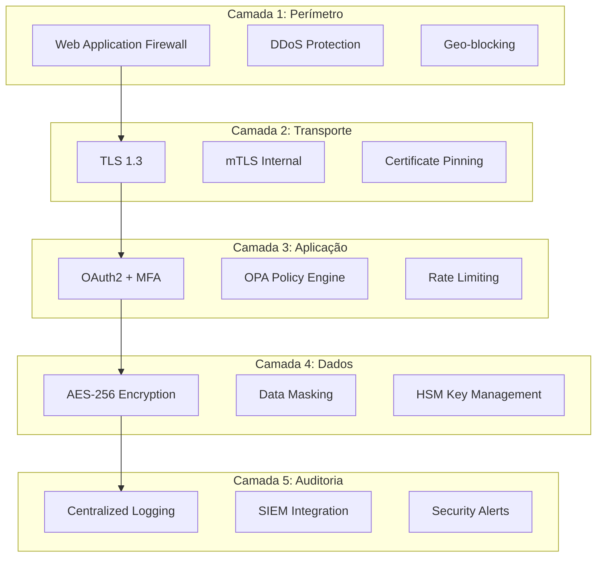

# KaminoClone - Segurança e Compliance

## 1. Visão Geral de Segurança

O KaminoClone implementa uma estratégia de segurança em camadas (Defense in Depth), garantindo compliance com:

- **PCI-DSS** (Payment Card Industry Data Security Standard)
- **LGPD** (Lei Geral de Proteção de Dados)
- **ISO 27001** (Gestão de Segurança da Informação)
- **SOC 2 Type II** (Service Organization Control)



## 2. Criptografia

### 2.1 Dados em Repouso (AES-256-GCM)

Todos os dados sensíveis são criptografados antes de serem armazenados:

```go
// internal/crypto/encryption.go
package crypto

import (
    "crypto/aes"
    "crypto/cipher"
    "crypto/rand"
    "encoding/base64"
    "errors"
    "fmt"
    "io"
)

type Encryptor struct {
    masterKey []byte
    gcm       cipher.AEAD
}

// NewEncryptor cria um novo encryptor com a chave mestre
func NewEncryptor(masterKeyBase64 string) (*Encryptor, error) {
    masterKey, err := base64.StdEncoding.DecodeString(masterKeyBase64)
    if err != nil {
        return nil, fmt.Errorf("invalid master key: %w", err)
    }
    
    if len(masterKey) != 32 {
        return nil, errors.New("master key must be 32 bytes for AES-256")
    }
    
    block, err := aes.NewCipher(masterKey)
    if err != nil {
        return nil, fmt.Errorf("failed to create cipher: %w", err)
    }
    
    gcm, err := cipher.NewGCM(block)
    if err != nil {
        return nil, fmt.Errorf("failed to create GCM: %w", err)
    }
    
    return &Encryptor{
        masterKey: masterKey,
        gcm:       gcm,
    }, nil
}

// Encrypt criptografa dados usando AES-256-GCM
func (e *Encryptor) Encrypt(plaintext []byte) ([]byte, error) {
    // Gerar nonce único (12 bytes para GCM)
    nonce := make([]byte, e.gcm.NonceSize())
    if _, err := io.ReadFull(rand.Reader, nonce); err != nil {
        return nil, fmt.Errorf("failed to generate nonce: %w", err)
    }
    
    // Criptografar (nonce é prefixado ao ciphertext)
    ciphertext := e.gcm.Seal(nonce, nonce, plaintext, nil)
    return ciphertext, nil
}

// Decrypt descriptografa dados
func (e *Encryptor) Decrypt(ciphertext []byte) ([]byte, error) {
    nonceSize := e.gcm.NonceSize()
    if len(ciphertext) < nonceSize {
        return nil, errors.New("ciphertext too short")
    }
    
    nonce, ciphertext := ciphertext[:nonceSize], ciphertext[nonceSize:]
    plaintext, err := e.gcm.Open(nil, nonce, ciphertext, nil)
    if err != nil {
        return nil, fmt.Errorf("decryption failed: %w", err)
    }
    
    return plaintext, nil
}

// EncryptString helper para strings
func (e *Encryptor) EncryptString(plaintext string) (string, error) {
    encrypted, err := e.Encrypt([]byte(plaintext))
    if err != nil {
        return "", err
    }
    return base64.StdEncoding.EncodeToString(encrypted), nil
}

// DecryptString helper para strings
func (e *Encryptor) DecryptString(ciphertext string) (string, error) {
    decoded, err := base64.StdEncoding.DecodeString(ciphertext)
    if err != nil {
        return "", fmt.Errorf("invalid base64: %w", err)
    }
    
    decrypted, err := e.Decrypt(decoded)
    if err != nil {
        return "", err
    }
    return string(decrypted), nil
}

// DeriveKey deriva uma chave específica para um contexto
func (e *Encryptor) DeriveKey(context string) ([]byte, error) {
    // Usa HKDF para derivar chaves específicas
    info := []byte(context)
    hkdf := hkdf.New(sha256.New, e.masterKey, nil, info)
    
    derivedKey := make([]byte, 32)
    if _, err := io.ReadFull(hkdf, derivedKey); err != nil {
        return nil, fmt.Errorf("key derivation failed: %w", err)
    }
    
    return derivedKey, nil
}
```

### 2.2 Dados em Trânsito (TLS 1.3)

Configuração do servidor HTTP com TLS 1.3:

```go
// internal/server/tls.go
package server

import (
    "crypto/tls"
    "net/http"
)

func NewSecureTLSConfig() *tls.Config {
    return &tls.Config{
        // Apenas TLS 1.3
        MinVersion: tls.VersionTLS13,
        MaxVersion: tls.VersionTLS13,
        
        // Cipher suites recomendados (TLS 1.3 usa estes automaticamente)
        CipherSuites: []uint16{
            tls.TLS_AES_256_GCM_SHA384,
            tls.TLS_CHACHA20_POLY1305_SHA256,
            tls.TLS_AES_128_GCM_SHA256,
        },
        
        // Curvas EC preferidas
        CurvePreferences: []tls.CurveID{
            tls.X25519,
            tls.CurveP384,
        },
        
        // Segurança adicional
        PreferServerCipherSuites: true,
        SessionTicketsDisabled:   false,
        
        // Renegociação desabilitada
        Renegotiation: tls.RenegotiateNever,
    }
}

func NewSecureServer(addr string, handler http.Handler, certFile, keyFile string) (*http.Server, error) {
    tlsConfig := NewSecureTLSConfig()
    
    return &http.Server{
        Addr:      addr,
        Handler:   handler,
        TLSConfig: tlsConfig,
        
        // Timeouts de segurança
        ReadTimeout:       10 * time.Second,
        WriteTimeout:      30 * time.Second,
        IdleTimeout:       120 * time.Second,
        ReadHeaderTimeout: 5 * time.Second,
        
        // Limites
        MaxHeaderBytes: 1 << 20, // 1MB
    }, nil
}
```

### 2.3 mTLS para Comunicação Interna

```go
// internal/server/mtls.go
package server

import (
    "crypto/tls"
    "crypto/x509"
    "fmt"
    "io/ioutil"
)

type MTLSConfig struct {
    CertFile   string
    KeyFile    string
    CAFile     string
    ServerName string
}

func NewMTLSConfig(cfg MTLSConfig) (*tls.Config, error) {
    // Carregar certificado do servidor
    cert, err := tls.LoadX509KeyPair(cfg.CertFile, cfg.KeyFile)
    if err != nil {
        return nil, fmt.Errorf("failed to load cert: %w", err)
    }
    
    // Carregar CA para verificar clientes
    caCert, err := ioutil.ReadFile(cfg.CAFile)
    if err != nil {
        return nil, fmt.Errorf("failed to load CA: %w", err)
    }
    
    caCertPool := x509.NewCertPool()
    if !caCertPool.AppendCertsFromPEM(caCert) {
        return nil, fmt.Errorf("failed to parse CA cert")
    }
    
    return &tls.Config{
        Certificates: []tls.Certificate{cert},
        ClientCAs:    caCertPool,
        ClientAuth:   tls.RequireAndVerifyClientCert,
        MinVersion:   tls.VersionTLS13,
        ServerName:   cfg.ServerName,
    }, nil
}

// NewMTLSClient cria um cliente HTTP com mTLS
func NewMTLSClient(cfg MTLSConfig) (*http.Client, error) {
    cert, err := tls.LoadX509KeyPair(cfg.CertFile, cfg.KeyFile)
    if err != nil {
        return nil, fmt.Errorf("failed to load client cert: %w", err)
    }
    
    caCert, err := ioutil.ReadFile(cfg.CAFile)
    if err != nil {
        return nil, fmt.Errorf("failed to load CA: %w", err)
    }
    
    caCertPool := x509.NewCertPool()
    caCertPool.AppendCertsFromPEM(caCert)
    
    tlsConfig := &tls.Config{
        Certificates: []tls.Certificate{cert},
        RootCAs:      caCertPool,
        MinVersion:   tls.VersionTLS13,
    }
    
    return &http.Client{
        Transport: &http.Transport{
            TLSClientConfig: tlsConfig,
        },
        Timeout: 30 * time.Second,
    }, nil
}
```

## 3. Autenticação e Autorização

### 3.1 OAuth2 + JWT

```go
// internal/auth/jwt.go
package auth

import (
    "context"
    "crypto/rsa"
    "errors"
    "time"
    
    "github.com/golang-jwt/jwt/v5"
)

type JWTConfig struct {
    PrivateKey     *rsa.PrivateKey
    PublicKey      *rsa.PublicKey
    Issuer         string
    Audience       []string
    AccessTokenTTL time.Duration
    RefreshTokenTTL time.Duration
}

type Claims struct {
    jwt.RegisteredClaims
    UserID      string   `json:"uid"`
    Email       string   `json:"email"`
    Roles       []string `json:"roles"`
    Permissions []string `json:"permissions"`
    SessionID   string   `json:"sid"`
    DeviceID    string   `json:"did"`
}

type JWTService struct {
    config JWTConfig
}

func NewJWTService(config JWTConfig) *JWTService {
    return &JWTService{config: config}
}

// GenerateTokenPair gera access e refresh tokens
func (s *JWTService) GenerateTokenPair(ctx context.Context, user *User, session *Session) (*TokenPair, error) {
    now := time.Now()
    
    // Access Token
    accessClaims := &Claims{
        RegisteredClaims: jwt.RegisteredClaims{
            Issuer:    s.config.Issuer,
            Subject:   user.ID,
            Audience:  s.config.Audience,
            ExpiresAt: jwt.NewNumericDate(now.Add(s.config.AccessTokenTTL)),
            NotBefore: jwt.NewNumericDate(now),
            IssuedAt:  jwt.NewNumericDate(now),
            ID:        generateTokenID(),
        },
        UserID:      user.ID,
        Email:       user.Email,
        Roles:       user.Roles,
        Permissions: user.Permissions,
        SessionID:   session.ID,
        DeviceID:    session.DeviceID,
    }
    
    accessToken := jwt.NewWithClaims(jwt.SigningMethodRS256, accessClaims)
    accessTokenString, err := accessToken.SignedString(s.config.PrivateKey)
    if err != nil {
        return nil, fmt.Errorf("failed to sign access token: %w", err)
    }
    
    // Refresh Token
    refreshClaims := &jwt.RegisteredClaims{
        Issuer:    s.config.Issuer,
        Subject:   user.ID,
        ExpiresAt: jwt.NewNumericDate(now.Add(s.config.RefreshTokenTTL)),
        NotBefore: jwt.NewNumericDate(now),
        IssuedAt:  jwt.NewNumericDate(now),
        ID:        generateTokenID(),
    }
    
    refreshToken := jwt.NewWithClaims(jwt.SigningMethodRS256, refreshClaims)
    refreshTokenString, err := refreshToken.SignedString(s.config.PrivateKey)
    if err != nil {
        return nil, fmt.Errorf("failed to sign refresh token: %w", err)
    }
    
    return &TokenPair{
        AccessToken:  accessTokenString,
        RefreshToken: refreshTokenString,
        ExpiresIn:    int64(s.config.AccessTokenTTL.Seconds()),
        TokenType:    "Bearer",
    }, nil
}

// ValidateToken valida um access token
func (s *JWTService) ValidateToken(tokenString string) (*Claims, error) {
    token, err := jwt.ParseWithClaims(tokenString, &Claims{}, func(token *jwt.Token) (interface{}, error) {
        if _, ok := token.Method.(*jwt.SigningMethodRSA); !ok {
            return nil, fmt.Errorf("unexpected signing method: %v", token.Header["alg"])
        }
        return s.config.PublicKey, nil
    })
    
    if err != nil {
        return nil, fmt.Errorf("token validation failed: %w", err)
    }
    
    claims, ok := token.Claims.(*Claims)
    if !ok || !token.Valid {
        return nil, errors.New("invalid token claims")
    }
    
    return claims, nil
}
```

### 3.2 Open Policy Agent (OPA) para Autorização

```rego
# policies/authz.rego
package kamino.authz

import future.keywords.if
import future.keywords.in

default allow := false

# Regras de acesso por role
allow if {
    some role in input.user.roles
    role == "admin"
}

# Acesso a transações
allow if {
    input.action == "read"
    input.resource.type == "transaction"
    input.resource.owner_id == input.user.id
}

allow if {
    input.action == "create"
    input.resource.type == "transaction"
    has_permission("transactions:create")
    within_daily_limit
}

# Acesso a cartões
allow if {
    input.action in ["read", "update"]
    input.resource.type == "card"
    input.resource.owner_id == input.user.id
}

allow if {
    input.action == "block"
    input.resource.type == "card"
    input.resource.owner_id == input.user.id
}

# Apenas admin pode ver dados de outros usuários
allow if {
    input.action == "read"
    input.resource.owner_id != input.user.id
    "admin" in input.user.roles
}

# Helpers
has_permission(perm) if {
    perm in input.user.permissions
}

within_daily_limit if {
    input.user.daily_spent + input.resource.amount <= input.user.daily_limit
}

# Rate limiting por user
rate_limit_exceeded if {
    input.user.request_count_minute > 100
}

# Detecção de comportamento suspeito
suspicious_activity if {
    input.user.failed_attempts_hour > 5
}

suspicious_activity if {
    input.request.country != input.user.usual_country
    input.resource.amount > input.user.usual_amount * 3
}
```

```go
// internal/auth/opa.go
package auth

import (
    "context"
    "fmt"
    
    "github.com/open-policy-agent/opa/rego"
)

type OPAAuthorizer struct {
    query rego.PreparedEvalQuery
}

func NewOPAAuthorizer(policyPath string) (*OPAAuthorizer, error) {
    ctx := context.Background()
    
    query, err := rego.New(
        rego.Query("data.kamino.authz.allow"),
        rego.Load([]string{policyPath}, nil),
    ).PrepareForEval(ctx)
    
    if err != nil {
        return nil, fmt.Errorf("failed to prepare OPA query: %w", err)
    }
    
    return &OPAAuthorizer{query: query}, nil
}

type AuthzInput struct {
    User     AuthzUser     `json:"user"`
    Action   string        `json:"action"`
    Resource AuthzResource `json:"resource"`
    Request  AuthzRequest  `json:"request"`
}

type AuthzUser struct {
    ID          string   `json:"id"`
    Roles       []string `json:"roles"`
    Permissions []string `json:"permissions"`
    DailyLimit  int64    `json:"daily_limit"`
    DailySpent  int64    `json:"daily_spent"`
}

type AuthzResource struct {
    Type    string `json:"type"`
    ID      string `json:"id"`
    OwnerID string `json:"owner_id"`
    Amount  int64  `json:"amount,omitempty"`
}

type AuthzRequest struct {
    IP        string `json:"ip"`
    Country   string `json:"country"`
    UserAgent string `json:"user_agent"`
}

func (a *OPAAuthorizer) Authorize(ctx context.Context, input AuthzInput) (bool, error) {
    results, err := a.query.Eval(ctx, rego.EvalInput(input))
    if err != nil {
        return false, fmt.Errorf("OPA evaluation failed: %w", err)
    }
    
    if len(results) == 0 {
        return false, nil
    }
    
    allowed, ok := results[0].Expressions[0].Value.(bool)
    if !ok {
        return false, nil
    }
    
    return allowed, nil
}
```

## 4. Máscara de Dados Sensíveis

### 4.1 Mascaramento em Logs

```go
// internal/logging/masking.go
package logging

import (
    "regexp"
    "strings"
)

type DataMasker struct {
    patterns map[string]*regexp.Regexp
}

func NewDataMasker() *DataMasker {
    return &DataMasker{
        patterns: map[string]*regexp.Regexp{
            // PAN do cartão (16 dígitos)
            "pan": regexp.MustCompile(`\b(\d{4})\d{8}(\d{4})\b`),
            
            // CVV (3-4 dígitos após vírgula ou espaço)
            "cvv": regexp.MustCompile(`(?i)(cvv|cvc|cvv2)[:\s]*(\d{3,4})`),
            
            // CPF (XXX.XXX.XXX-XX)
            "cpf": regexp.MustCompile(`\b(\d{3})\.\d{3}\.\d{3}-(\d{2})\b`),
            
            // CNPJ (XX.XXX.XXX/XXXX-XX)
            "cnpj": regexp.MustCompile(`\b(\d{2})\.\d{3}\.\d{3}/\d{4}-(\d{2})\b`),
            
            // Email
            "email": regexp.MustCompile(`([a-zA-Z0-9._%+-]+)@([a-zA-Z0-9.-]+\.[a-zA-Z]{2,})`),
            
            // Telefone
            "phone": regexp.MustCompile(`\+?(\d{2})[\s-]?(\d{2})[\s-]?\d{4,5}[\s-]?(\d{4})`),
            
            // Senha em JSON
            "password": regexp.MustCompile(`(?i)"(password|senha|secret|token)":\s*"[^"]+"`),
            
            // API Keys
            "apikey": regexp.MustCompile(`(?i)(api[_-]?key|apikey|api_secret|secret_key)[:\s=]*["']?([a-zA-Z0-9_-]{20,})["']?`),
            
            // Bearer Token
            "bearer": regexp.MustCompile(`(?i)bearer\s+([a-zA-Z0-9_-]+\.?){2,}`),
        },
    }
}

func (m *DataMasker) Mask(input string) string {
    result := input
    
    // PAN: 1234********5678
    result = m.patterns["pan"].ReplaceAllString(result, "$1********$2")
    
    // CVV: cvv: ***
    result = m.patterns["cvv"].ReplaceAllString(result, "$1: ***")
    
    // CPF: 123.***.***-45
    result = m.patterns["cpf"].ReplaceAllString(result, "$1.***.***-$2")
    
    // CNPJ: 12.***.***/**-34
    result = m.patterns["cnpj"].ReplaceAllString(result, "$1.***.***/**-$2")
    
    // Email: a***@domain.com
    result = m.patterns["email"].ReplaceAllStringFunc(result, func(s string) string {
        parts := m.patterns["email"].FindStringSubmatch(s)
        if len(parts) >= 3 {
            local := parts[1]
            domain := parts[2]
            if len(local) > 2 {
                local = local[:1] + strings.Repeat("*", len(local)-1)
            }
            return local + "@" + domain
        }
        return s
    })
    
    // Telefone: +55 11 ****-1234
    result = m.patterns["phone"].ReplaceAllString(result, "+$1 $2 ****-$3")
    
    // Senha: "password": "[REDACTED]"
    result = m.patterns["password"].ReplaceAllString(result, `"$1": "[REDACTED]"`)
    
    // API Key: api_key: ****...****
    result = m.patterns["apikey"].ReplaceAllString(result, "$1: ****[REDACTED]****")
    
    // Bearer: bearer [REDACTED]
    result = m.patterns["bearer"].ReplaceAllString(result, "bearer [REDACTED]")
    
    return result
}

// MaskJSON mascara campos específicos em JSON
func (m *DataMasker) MaskJSON(data map[string]interface{}) map[string]interface{} {
    sensitiveFields := map[string]bool{
        "password":     true,
        "senha":        true,
        "secret":       true,
        "token":        true,
        "api_key":      true,
        "apiKey":       true,
        "pan":          true,
        "card_number":  true,
        "cardNumber":   true,
        "cvv":          true,
        "cvc":          true,
        "cpf":          true,
        "cnpj":         true,
        "tax_id":       true,
        "taxId":        true,
        "ssn":          true,
    }
    
    result := make(map[string]interface{})
    for key, value := range data {
        if sensitiveFields[strings.ToLower(key)] {
            result[key] = "[REDACTED]"
            continue
        }
        
        switch v := value.(type) {
        case map[string]interface{}:
            result[key] = m.MaskJSON(v)
        case string:
            result[key] = m.Mask(v)
        default:
            result[key] = value
        }
    }
    return result
}
```

### 4.2 Mascaramento no Kafka

```go
// internal/kafka/masked_producer.go
package kafka

import (
    "context"
    "encoding/json"
    
    "github.com/segmentio/kafka-go"
    "kaminoclone/internal/logging"
)

type MaskedProducer struct {
    writer *kafka.Writer
    masker *logging.DataMasker
}

func NewMaskedProducer(brokers []string, topic string) *MaskedProducer {
    return &MaskedProducer{
        writer: &kafka.Writer{
            Addr:     kafka.TCP(brokers...),
            Topic:    topic,
            Balancer: &kafka.LeastBytes{},
        },
        masker: logging.NewDataMasker(),
    }
}

// WriteMessage escreve mensagem com dados sensíveis mascarados nos headers
func (p *MaskedProducer) WriteMessage(ctx context.Context, key []byte, value interface{}) error {
    // Serializar valor
    data, err := json.Marshal(value)
    if err != nil {
        return err
    }
    
    // Criar versão mascarada para logging/debug
    var original map[string]interface{}
    json.Unmarshal(data, &original)
    masked := p.masker.MaskJSON(original)
    maskedData, _ := json.Marshal(masked)
    
    msg := kafka.Message{
        Key:   key,
        Value: data,  // Dados originais (criptografados se necessário)
        Headers: []kafka.Header{
            {
                Key:   "masked_preview",
                Value: maskedData,  // Para debug/logging
            },
            {
                Key:   "content_type",
                Value: []byte("application/json"),
            },
        },
    }
    
    return p.writer.WriteMessages(ctx, msg)
}
```

## 5. Auditoria e Logging

### 5.1 Structured Logging com Mascaramento

```go
// internal/logging/logger.go
package logging

import (
    "context"
    "os"
    
    "go.uber.org/zap"
    "go.uber.org/zap/zapcore"
)

type Logger struct {
    *zap.SugaredLogger
    masker *DataMasker
}

func NewLogger(env string) (*Logger, error) {
    var config zap.Config
    
    if env == "production" {
        config = zap.NewProductionConfig()
        config.Encoding = "json"
    } else {
        config = zap.NewDevelopmentConfig()
        config.EncoderConfig.EncodeLevel = zapcore.CapitalColorLevelEncoder
    }
    
    // Adicionar campos padrão
    config.InitialFields = map[string]interface{}{
        "service": "kaminoclone",
        "version": os.Getenv("APP_VERSION"),
    }
    
    logger, err := config.Build(
        zap.AddCallerSkip(1),
        zap.AddStacktrace(zapcore.ErrorLevel),
    )
    if err != nil {
        return nil, err
    }
    
    return &Logger{
        SugaredLogger: logger.Sugar(),
        masker:        NewDataMasker(),
    }, nil
}

// LogWithContext loga com contexto de request
func (l *Logger) LogWithContext(ctx context.Context) *Logger {
    requestID := ctx.Value("request_id")
    userID := ctx.Value("user_id")
    correlationID := ctx.Value("correlation_id")
    
    return &Logger{
        SugaredLogger: l.With(
            "request_id", requestID,
            "user_id", userID,
            "correlation_id", correlationID,
        ),
        masker: l.masker,
    }
}

// InfoMasked loga informação com dados mascarados
func (l *Logger) InfoMasked(msg string, keysAndValues ...interface{}) {
    masked := l.maskKeysAndValues(keysAndValues)
    l.Infow(msg, masked...)
}

// ErrorMasked loga erro com dados mascarados
func (l *Logger) ErrorMasked(msg string, keysAndValues ...interface{}) {
    masked := l.maskKeysAndValues(keysAndValues)
    l.Errorw(msg, masked...)
}

func (l *Logger) maskKeysAndValues(keysAndValues []interface{}) []interface{} {
    result := make([]interface{}, len(keysAndValues))
    for i, v := range keysAndValues {
        switch val := v.(type) {
        case string:
            result[i] = l.masker.Mask(val)
        case map[string]interface{}:
            result[i] = l.masker.MaskJSON(val)
        default:
            result[i] = v
        }
    }
    return result
}
```

### 5.2 Trilha de Auditoria para Compliance

```go
// internal/audit/trail.go
package audit

import (
    "context"
    "encoding/json"
    "time"
    
    "github.com/google/uuid"
)

type AuditEvent struct {
    ID            string                 `json:"id"`
    Timestamp     time.Time              `json:"timestamp"`
    
    // Quem
    ActorType     string                 `json:"actor_type"`  // USER, SYSTEM, ADMIN, API
    ActorID       string                 `json:"actor_id"`
    ActorEmail    string                 `json:"actor_email,omitempty"`
    
    // O quê
    Action        string                 `json:"action"`
    ResourceType  string                 `json:"resource_type"`
    ResourceID    string                 `json:"resource_id"`
    
    // Detalhes
    OldValue      json.RawMessage        `json:"old_value,omitempty"`
    NewValue      json.RawMessage        `json:"new_value,omitempty"`
    Metadata      map[string]interface{} `json:"metadata,omitempty"`
    
    // Contexto
    IPAddress     string                 `json:"ip_address"`
    UserAgent     string                 `json:"user_agent"`
    CorrelationID string                 `json:"correlation_id"`
    
    // Resultado
    Status        string                 `json:"status"`  // SUCCESS, FAILED, DENIED
    ErrorMessage  string                 `json:"error_message,omitempty"`
}

type AuditTrail struct {
    writer  AuditWriter
    masker  *DataMasker
}

type AuditWriter interface {
    Write(ctx context.Context, event *AuditEvent) error
}

func NewAuditTrail(writer AuditWriter) *AuditTrail {
    return &AuditTrail{
        writer: writer,
        masker: NewDataMasker(),
    }
}

// LogAction registra uma ação de auditoria
func (a *AuditTrail) LogAction(ctx context.Context, action string, resource Resource, opts ...AuditOption) error {
    event := &AuditEvent{
        ID:            uuid.New().String(),
        Timestamp:     time.Now().UTC(),
        Action:        action,
        ResourceType:  resource.Type,
        ResourceID:    resource.ID,
        Status:        "SUCCESS",
        CorrelationID: getCorrelationID(ctx),
    }
    
    // Aplicar opções
    for _, opt := range opts {
        opt(event)
    }
    
    // Extrair contexto
    if actor := getActor(ctx); actor != nil {
        event.ActorType = actor.Type
        event.ActorID = actor.ID
        event.ActorEmail = actor.Email
    }
    
    if reqCtx := getRequestContext(ctx); reqCtx != nil {
        event.IPAddress = reqCtx.IPAddress
        event.UserAgent = reqCtx.UserAgent
    }
    
    // Mascarar valores sensíveis
    if event.OldValue != nil {
        var oldMap map[string]interface{}
        json.Unmarshal(event.OldValue, &oldMap)
        maskedOld := a.masker.MaskJSON(oldMap)
        event.OldValue, _ = json.Marshal(maskedOld)
    }
    
    if event.NewValue != nil {
        var newMap map[string]interface{}
        json.Unmarshal(event.NewValue, &newMap)
        maskedNew := a.masker.MaskJSON(newMap)
        event.NewValue, _ = json.Marshal(maskedNew)
    }
    
    return a.writer.Write(ctx, event)
}

// Opções de auditoria
type AuditOption func(*AuditEvent)

func WithOldValue(value interface{}) AuditOption {
    return func(e *AuditEvent) {
        data, _ := json.Marshal(value)
        e.OldValue = data
    }
}

func WithNewValue(value interface{}) AuditOption {
    return func(e *AuditEvent) {
        data, _ := json.Marshal(value)
        e.NewValue = data
    }
}

func WithMetadata(metadata map[string]interface{}) AuditOption {
    return func(e *AuditEvent) {
        e.Metadata = metadata
    }
}

func WithStatus(status string, errMsg string) AuditOption {
    return func(e *AuditEvent) {
        e.Status = status
        e.ErrorMessage = errMsg
    }
}
```

## 6. PCI-DSS Compliance

### 6.1 Tokenização de Cartões

```go
// internal/pci/tokenizer.go
package pci

import (
    "context"
    "crypto/aes"
    "crypto/cipher"
    "crypto/rand"
    "encoding/hex"
    "fmt"
    "io"
)

type CardTokenizer struct {
    encryptor *crypto.Encryptor
    storage   TokenStorage
}

type TokenStorage interface {
    Store(ctx context.Context, token string, encryptedPAN []byte) error
    Retrieve(ctx context.Context, token string) ([]byte, error)
    Delete(ctx context.Context, token string) error
}

type CardData struct {
    PAN         string
    ExpiryMonth int
    ExpiryYear  int
    CVV         string // Nunca armazenado
}

type TokenizedCard struct {
    Token        string
    PANLastFour  string
    PANHash      string  // Para detecção de duplicatas
    ExpiryMonth  int
    ExpiryYear   int
}

func NewCardTokenizer(encryptor *crypto.Encryptor, storage TokenStorage) *CardTokenizer {
    return &CardTokenizer{
        encryptor: encryptor,
        storage:   storage,
    }
}

// Tokenize cria um token para um cartão
func (t *CardTokenizer) Tokenize(ctx context.Context, card *CardData) (*TokenizedCard, error) {
    // Validar PAN
    if !isValidLuhn(card.PAN) {
        return nil, fmt.Errorf("invalid card number")
    }
    
    // Gerar token único
    token := t.generateToken()
    
    // Criptografar PAN
    encryptedPAN, err := t.encryptor.Encrypt([]byte(card.PAN))
    if err != nil {
        return nil, fmt.Errorf("encryption failed: %w", err)
    }
    
    // Armazenar
    if err := t.storage.Store(ctx, token, encryptedPAN); err != nil {
        return nil, fmt.Errorf("storage failed: %w", err)
    }
    
    // Gerar hash do PAN para detecção de duplicatas
    panHash := sha256.Sum256([]byte(card.PAN))
    
    return &TokenizedCard{
        Token:       token,
        PANLastFour: card.PAN[len(card.PAN)-4:],
        PANHash:     hex.EncodeToString(panHash[:]),
        ExpiryMonth: card.ExpiryMonth,
        ExpiryYear:  card.ExpiryYear,
    }, nil
}

// Detokenize recupera o PAN original (apenas para processamento)
func (t *CardTokenizer) Detokenize(ctx context.Context, token string) (string, error) {
    encryptedPAN, err := t.storage.Retrieve(ctx, token)
    if err != nil {
        return "", fmt.Errorf("token not found: %w", err)
    }
    
    pan, err := t.encryptor.Decrypt(encryptedPAN)
    if err != nil {
        return "", fmt.Errorf("decryption failed: %w", err)
    }
    
    return string(pan), nil
}

func (t *CardTokenizer) generateToken() string {
    bytes := make([]byte, 16)
    rand.Read(bytes)
    return "tok_" + hex.EncodeToString(bytes)
}

// Validação Luhn
func isValidLuhn(pan string) bool {
    sum := 0
    isSecond := false
    
    for i := len(pan) - 1; i >= 0; i-- {
        d := int(pan[i] - '0')
        
        if isSecond {
            d = d * 2
            if d > 9 {
                d = d - 9
            }
        }
        
        sum += d
        isSecond = !isSecond
    }
    
    return sum%10 == 0
}
```

## 7. Rate Limiting e Proteção contra Ataques

```go
// internal/middleware/ratelimit.go
package middleware

import (
    "context"
    "fmt"
    "net/http"
    "time"
    
    "github.com/go-redis/redis/v8"
    "golang.org/x/time/rate"
)

type RateLimiter struct {
    redis       *redis.Client
    limiters    map[string]*rate.Limiter
    globalLimit rate.Limit
    burstLimit  int
}

type RateLimitConfig struct {
    // Por IP
    IPRateLimit      int           // Requests por segundo
    IPBurstLimit     int           // Burst máximo
    
    // Por usuário
    UserRateLimit    int
    UserBurstLimit   int
    
    // Por endpoint
    EndpointLimits   map[string]int
    
    // Janela de tempo
    Window           time.Duration
}

func NewRateLimiter(redis *redis.Client, config RateLimitConfig) *RateLimiter {
    return &RateLimiter{
        redis:       redis,
        limiters:    make(map[string]*rate.Limiter),
        globalLimit: rate.Limit(config.IPRateLimit),
        burstLimit:  config.IPBurstLimit,
    }
}

func (rl *RateLimiter) Middleware(next http.Handler) http.Handler {
    return http.HandlerFunc(func(w http.ResponseWriter, r *http.Request) {
        ctx := r.Context()
        
        // Extrair identificadores
        ip := getClientIP(r)
        userID := getUserIDFromContext(ctx)
        endpoint := r.URL.Path
        
        // Verificar rate limits
        if exceeded, retryAfter := rl.checkLimit(ctx, ip, userID, endpoint); exceeded {
            w.Header().Set("Retry-After", fmt.Sprintf("%d", retryAfter))
            w.Header().Set("X-RateLimit-Remaining", "0")
            http.Error(w, "Too Many Requests", http.StatusTooManyRequests)
            return
        }
        
        next.ServeHTTP(w, r)
    })
}

func (rl *RateLimiter) checkLimit(ctx context.Context, ip, userID, endpoint string) (bool, int) {
    // Sliding window rate limiting usando Redis
    now := time.Now()
    windowKey := fmt.Sprintf("ratelimit:%s:%d", ip, now.Unix()/60)
    
    pipe := rl.redis.Pipeline()
    incr := pipe.Incr(ctx, windowKey)
    pipe.Expire(ctx, windowKey, 2*time.Minute)
    _, err := pipe.Exec(ctx)
    
    if err != nil {
        // Em caso de erro, permitir (fail open) mas logar
        return false, 0
    }
    
    count := incr.Val()
    limit := int64(rl.globalLimit * 60) // Limite por minuto
    
    if count > limit {
        retryAfter := 60 - (now.Unix() % 60)
        return true, int(retryAfter)
    }
    
    return false, 0
}
```

Este documento define as práticas de segurança e compliance do KaminoClone. Todas as implementações devem seguir estas diretrizes para garantir a proteção dos dados dos usuários e a conformidade regulatória.
