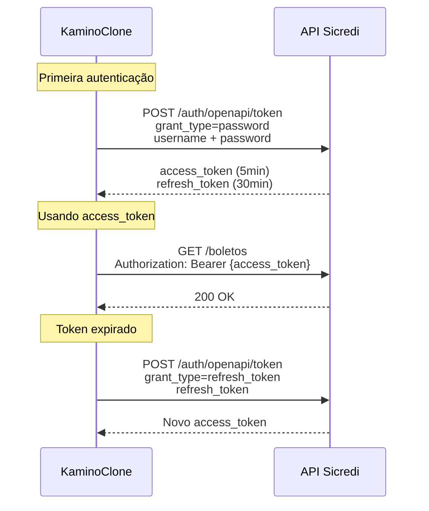
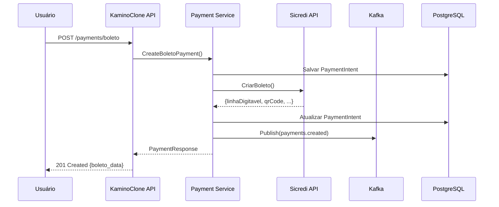

# KaminoClone - Integração Sicredi

## Visão Geral

Este documento descreve a integração com a **API de Cobrança do Sicredi**, permitindo a emissão de boletos tradicionais e híbridos (com QR Code PIX).

## Funcionalidades Disponíveis

| Funcionalidade | Endpoint | Método |
|----------------|----------|--------|
| Autenticação OAuth2 | `/auth/openapi/token` | POST |
| Criar Boleto | `/boletos` | POST |
| Consultar Boleto | `/boletos` | GET |
| Imprimir Boleto (PDF) | `/boletos/pdf` | GET |
| Baixar Boleto | `/boletos/{nossoNumero}/baixa` | PATCH |
| Alterar Vencimento | `/boletos/{nossoNumero}/data-vencimento` | PATCH |
| Alterar Desconto | `/boletos/{nossoNumero}/desconto` | PATCH |
| Alterar Data Desconto | `/boletos/{nossoNumero}/data-desconto` | PATCH |
| Alterar Juros | `/boletos/{nossoNumero}/juros` | PATCH |
| Alterar Seu Número | `/boletos/{nossoNumero}/seu-numero` | PATCH |
| Consultar Liquidados | `/boletos/liquidados/dia` | GET |

## Configuração

### 1. Pré-requisitos no Sicredi

1. **Contratar o Produto Cobrança** junto à cooperativa
2. **Optar pela modalidade API (Cobrança Online)**
3. **Cadastrar-se no Portal do Desenvolvedor**: https://developer.sicredi.com.br/api-portal
4. **Criar uma APP** no portal e selecionar as APIs:
   - `API COBRANÇA BOLETO 1.0.0`
   - `API AUTH - OPENAPI - PARCEIROS 1.0.0`
5. **Solicitar o Access Token** via chamado no portal
6. **Gerar Código de Acesso** no Internet Banking:
   - Menu: Cobrança > Código de Acesso > Gerar

### 2. Configuração do Adapter

```go
import "kaminoclone/services/integrations/sicredi"

config := sicredi.SicrediConfig{
    // Credenciais do Portal do Desenvolvedor
    APIKey: "uuid-do-access-token-do-portal",  // x-api-key
    
    // Credenciais do Beneficiário (autenticação OAuth2)
    Username: "1234501234",  // CodigoBeneficiario (5 dígitos) + CodigoCooperativa (4 dígitos)
    Password: "codigo-gerado-no-internet-banking",
    
    // Dados do Beneficiário
    Cooperativa:        "0123",   // 4 dígitos
    Posto:              "02",     // 2 dígitos
    CodigoBeneficiario: "12345",  // 5 dígitos
    
    // Ambiente
    UseSandbox: true,  // false para produção
    
    // Timeouts
    Timeout:    30 * time.Second,
    MaxRetries: 3,
}

adapter := sicredi.NewSicrediAdapter(config)
```

### 3. URLs dos Ambientes

| Ambiente | URL Base |
|----------|----------|
| **Sandbox** | `https://api-parceiro.sicredi.com.br/sb/cobranca/boleto/v1` |
| **Produção** | `https://api-parceiro.sicredi.com.br/cobranca/boleto/v1` |

### 4. Credenciais de Sandbox (Homologação)

Para testes no ambiente sandbox, use:

```
username: 123456789
password: teste123
cooperativa: 6789
posto: 03
codigoBeneficiario: 12345
```

## Fluxo de Autenticação



## Tipos de Boleto

### Boleto Tradicional (NORMAL)

Boleto com código de barras e linha digitável tradicional.

```go
boleto := sicredi.CriarBoletoRequest{
    TipoCobranca:       sicredi.TipoCobrancaNormal,
    CodigoBeneficiario: "12345",
    Pagador: sicredi.Pagador{
        TipoPessoa: sicredi.TipoPessoaFisica,
        Documento:  "12345678909",
        Nome:       "NOME DO PAGADOR",
        Endereco:   "RUA EXEMPLO, 123",
        Cidade:     "PORTO ALEGRE",
        UF:         "RS",
        CEP:        "91000000",
    },
    EspecieDocumento: sicredi.EspecieDuplicataMercantil,
    SeuNumero:        "REF-001",
    DataVencimento:   "2026-02-28",
    Valor:            100.00,
}
```

### Boleto Híbrido (PIX)

Boleto com QR Code PIX, permitindo pagamento por código de barras OU PIX.

```go
boleto := sicredi.CriarBoletoRequest{
    TipoCobranca:       sicredi.TipoCobrancaHibrido,  // Habilita PIX
    CodigoBeneficiario: "12345",
    Pagador: sicredi.Pagador{
        TipoPessoa: sicredi.TipoPessoaFisica,
        Documento:  "12345678909",
        Nome:       "NOME DO PAGADOR",
    },
    EspecieDocumento:       sicredi.EspecieDuplicataMercantil,
    SeuNumero:              "REF-001",
    DataVencimento:         "2026-02-28",
    Valor:                  100.00,
    ValidadeAposVencimento: 30,  // QRCode válido 30 dias após vencimento
}

resp, _ := adapter.CriarBoleto(ctx, boleto)

// Resposta inclui dados do PIX
fmt.Println(resp.TxID)    // Identificador da transação PIX
fmt.Println(resp.QRCode)  // Código "copia e cola" do PIX
```

## Espécies de Documento

| Código | Espécie | Permite Protesto |
|--------|---------|------------------|
| `DUPLICATA_MERCANTIL_INDICACAO` | Duplicata Mercantil | Sim |
| `DUPLICATA_RURAL` | Duplicata Rural | Sim |
| `NOTA_PROMISSORIA` | Nota Promissória | Sim |
| `NOTA_PROMISSORIA_RURAL` | Nota Promissória Rural | Sim |
| `NOTA_SEGUROS` | Nota de Seguros | Sim |
| `RECIBO` | Recibo | **Não** |
| `LETRA_CAMBIO` | Letra de Câmbio | Sim |
| `NOTA_DEBITO` | Nota de Débito | **Não** |
| `DUPLICATA_SERVICO_INDICACAO` | Duplicata de Serviço | Sim |
| `OUTROS` | Outros | **Não** |
| `BOLETO_PROPOSTA` | Boleto Proposta | **Não** |
| `CARTAO_CREDITO` | Cartão de Crédito | **Não** |

## Situações do Boleto

| Situação | Descrição |
|----------|-----------|
| `EM CARTEIRA` | Disponível para pagamento |
| `EM CARTEIRA PIX` | Disponível para pagamento (híbrido) |
| `VENCIDO` | Após vencimento, ainda não pago |
| `LIQUIDADO` | Pago pelo pagador |
| `LIQUIDADO PIX` | Pago via PIX |
| `LIQUIDADO REDE` | Pago via rede bancária |
| `LIQUIDADO COMPE` | Pago via compensação |
| `BAIXADO POR SOLICITACAO` | Baixa solicitada pelo beneficiário |
| `PROTESTADO` | Protestado em cartório |
| `EM CARTORIO` | Em processo de protesto |
| `NEGATIVADO` | Negativado no Serasa |
| `REJEITADO` | Rejeitado na entrada |

## Geração do Nosso Número

Se não informado, o Sicredi gera automaticamente. Para gerar manualmente:

**Formato:** `AABnnnnnD`

- `AA` = Ano (2 dígitos)
- `B` = Byte de geração (2-9, use 2-9 para geração própria)
- `nnnnn` = Sequencial (00000-99999)
- `D` = Dígito verificador (Módulo 11)

### Cálculo do Dígito Verificador

```go
func calcularDV(cooperativa, posto, beneficiario, ano, byte, sequencial string) int {
    // Concatenar: cooperativa(4) + posto(2) + beneficiario(5) + ano(2) + byte(1) + sequencial(5)
    numero := cooperativa + posto + beneficiario + ano + byte + sequencial
    
    // Aplicar pesos 2-9 da direita para esquerda
    pesos := []int{2, 3, 4, 5, 6, 7, 8, 9}
    soma := 0
    
    for i := len(numero) - 1; i >= 0; i-- {
        digito, _ := strconv.Atoi(string(numero[i]))
        peso := pesos[(len(numero)-1-i) % 8]
        soma += digito * peso
    }
    
    resto := soma % 11
    dv := 11 - resto
    
    if dv == 10 || dv == 11 {
        dv = 0
    }
    
    return dv
}
```

## Rate Limit

A API possui limite de **300 requisições por segundo** em ambos os ambientes.

## Tratamento de Erros

### Códigos HTTP Comuns

| Código | Descrição |
|--------|-----------|
| `200` | Sucesso (GET) |
| `201` | Criado com sucesso (POST) |
| `202` | Aceito (comandos de instrução) |
| `400` | Requisição inválida |
| `401` | Não autorizado |
| `404` | Não encontrado |
| `422` | Erro de negócio |
| `429` | Too Many Requests |
| `504` | Gateway Timeout |

### Exemplo de Tratamento

```go
resp, err := adapter.CriarBoleto(ctx, boleto)
if err != nil {
    // Verificar tipo de erro
    switch {
    case strings.Contains(err.Error(), "401"):
        // Reautenticar
        adapter.Authenticate(ctx)
        resp, err = adapter.CriarBoleto(ctx, boleto)
    case strings.Contains(err.Error(), "422"):
        // Erro de negócio - verificar mensagem
        log.Printf("Erro de negócio: %v", err)
    case strings.Contains(err.Error(), "429"):
        // Rate limit - aguardar e retry
        time.Sleep(1 * time.Second)
        resp, err = adapter.CriarBoleto(ctx, boleto)
    }
}
```

## Webhooks

O Sicredi não possui webhooks nativos para a API de Cobrança. Para receber notificações de pagamento:

1. **Consulta periódica** de boletos liquidados via `/boletos/liquidados/dia`
2. **Integração com PIX** para receber webhooks de pagamentos PIX (boletos híbridos)

### Reconciliação Automática

```go
// Executar diariamente
func reconciliarBoletos(adapter *sicredi.SicrediAdapter) {
    ctx := context.Background()
    ontem := time.Now().AddDate(0, 0, -1).Format("02/01/2006")
    
    pagina := 0
    for {
        resp, err := adapter.ConsultarLiquidadosPorDia(ctx, ontem, pagina)
        if err != nil {
            log.Printf("Erro na reconciliação: %v", err)
            break
        }
        
        for _, boleto := range resp.Items {
            // Atualizar status no sistema
            processarPagamento(boleto)
        }
        
        if !resp.HasNext {
            break
        }
        pagina++
    }
}
```

## Integração com KaminoClone

### Fluxo de Criação de Boleto



### Mapeamento de Dados

```go
// Converter PaymentIntent para boleto Sicredi
func mapPaymentToBoleto(payment *PaymentIntent) sicredi.CriarBoletoRequest {
    return sicredi.CriarBoletoRequest{
        TipoCobranca:       sicredi.TipoCobrancaHibrido,
        CodigoBeneficiario: os.Getenv("SICREDI_BENEFICIARIO"),
        Pagador: sicredi.Pagador{
            TipoPessoa: mapTipoPessoa(payment.Customer.Type),
            Documento:  payment.Customer.TaxID,
            Nome:       payment.Customer.Name,
            Endereco:   payment.Customer.Address.Street,
            Cidade:     payment.Customer.Address.City,
            UF:         payment.Customer.Address.State,
            CEP:        payment.Customer.Address.PostalCode,
            Email:      payment.Customer.Email,
        },
        EspecieDocumento: sicredi.EspecieDuplicataServico,
        SeuNumero:        payment.Reference,
        DataVencimento:   payment.DueDate.Format("2006-01-02"),
        Valor:            float64(payment.Amount) / 100, // Centavos para reais
    }
}
```

## Suporte

- **Portal do Desenvolvedor**: https://developer.sicredi.com.br/api-portal
- **FAQ**: https://developer.sicredi.com.br/api-portal/content/faq
- **Chat**: https://dev-sicredi.zendesk.com/hc/pt-br
